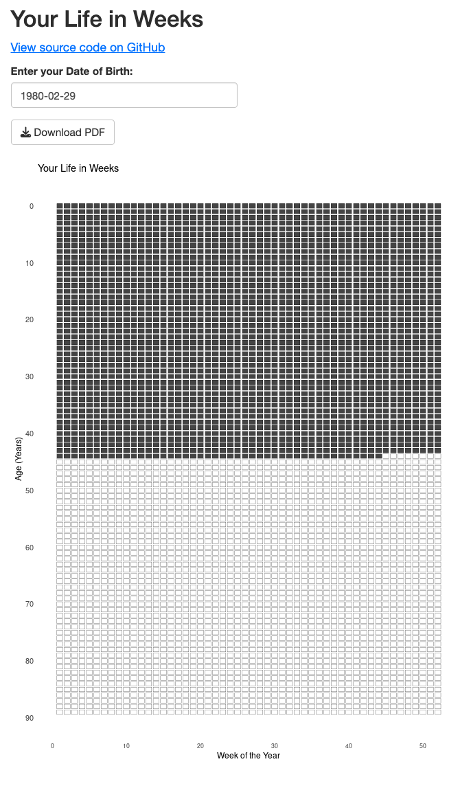

# lifeweeks

Visualize your life in weeks in either R (shiny) or Python (CLI). 

Input your birthday and see how many weeks you have lived and how many weeks you have left (generously assuming a 90-year lifespan). Both the Python and R implementations provide a printable PDF. 

Inspired by [this post from Tim Urban](https://waitbutwhy.com/2014/05/life-weeks.html). *"Sometimes life seems really short, and other times it seems impossibly long. But this chart helps to emphasize that it's most certainly finite. Those are your weeks and they're all you've got."*


## Python

Install with pip:

```sh
pip install lifeweeks
lifeweeks --help
```

Or run without installing using [uv/uvx](https://docs.astral.sh/uv/guides/tools/):

```sh
uvx lifeweeks --help
```

```
Usage: lifeweeks [OPTIONS] BIRTHDAY

  Generate a life-in-weeks chart for a given BIRTHDAY.
  Birthday should be entered as YYYY-MM-DD.

  Example: lifeweeks 1980-02-14

Options:
  -o, --output TEXT  Output filename (default: lifeweeks.pdf)
  -h, --help         Show this message and exit.
```

Example:

```sh
lifeweeks 1980-02-14
```

Result:


## R/Shiny

Go to [**stephenturner.shinyapps.io/lifeweeks**](https://stephenturner.shinyapps.io/lifeweeks/) or run the [app.r](app.r) app yourself to launch the shiny app. Input your birthday and see how many weeks you have lived and how many weeks you have left. Hit the Download PDF button to save the plot.



